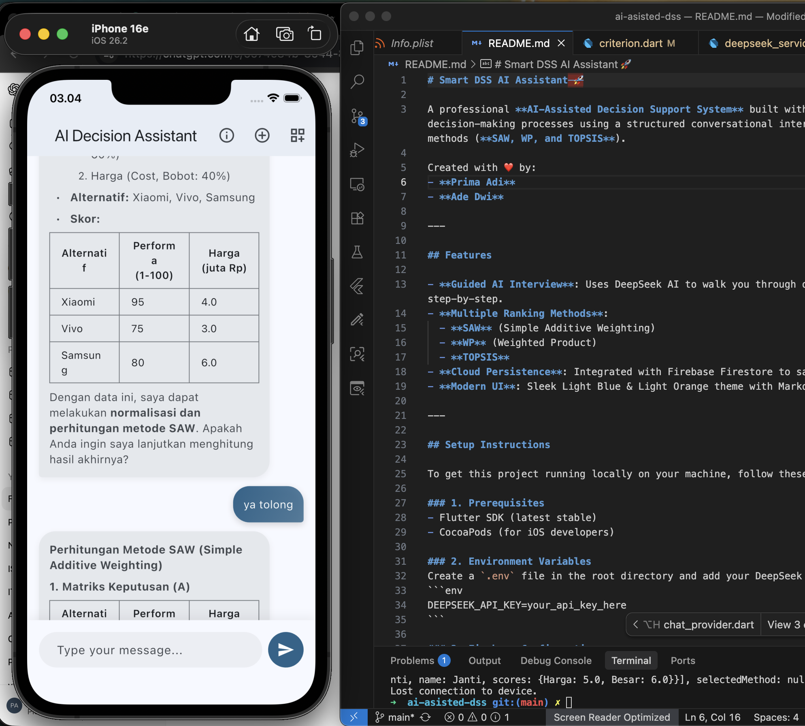

# Smart DSS AI Assistant 🚀



A professional **AI-Assisted Decision Support System** built with Flutter. This app guides users through complex decision-making processes using a structured conversational interface and calculates rankings using standard DSS methods (**SAW, WP, and TOPSIS**).

Created with ❤️ by:
- **Prima Adi**
- **Ade Dwi**

---

## Features

- **🤖 Guided AI Interview**: Uses DeepSeek AI to walk you through defining a decision, criteria, and alternatives step-by-step.
- **🌍 Multi-Language Support**: Fully localized in **English** and **Indonesian**. The AI also adapts its language based on your preference.
- **🌗 Dark Mode**: Seamless support for Light, Dark, and System themes.
- **📊 Multiple Ranking Methods**:
  - **SAW** (Simple Additive Weighting)
  - **WP** (Weighted Product)
  - **TOPSIS**
- **📜 Decision History**: Save your sessions automatically. Resume previous conversations or **reuse data** (criteria/alternatives) for new calculations.
- **⚡ Smart Shortcuts**: Quick-access chips to trigger calculations (SAW/WP/TOPSIS) instantly when data is ready.
- **☁️ Cloud Persistence**: Integrated with Firebase Firestore to sync your decision cases securely.

---

## Setup Instructions

To get this project running locally on your machine, follow these steps:

### 1. Prerequisites
- Flutter SDK (latest stable)
- CocoaPods (for iOS developers)

### 2. Environment Variables
Create a `.env` file in the root directory and add your DeepSeek API key:
```env
DEEPSEEK_API_KEY=your_api_key_here
```

### 3. Firebase Configuration
Since sensitive config files are ignored in Git, you need to add your own:
- **iOS**: Place your `GoogleService-Info.plist` in `ios/Runner/`.
- **Android**: Place your `google-services.json` in `android/app/`.
- **Logic**: Run `flutterfire configure` if you have the FlutterFire CLI, or manually update `lib/firebase_options.dart`.

### 4. Install Dependencies
Run the following command to fetch all packages:
```bash
flutter pub get
```

### 5. Generate Models
This project uses `json_serializable`. Generate the necessary code by running:
```bash
dart run build_runner build --delete-conflicting-outputs
```

### 6. Run the App
```bash
flutter run
```

---

## Architecture

- **Logic**: All DSS mathematical calculations are executed locally in `lib/logic/dss_engine.dart` (not by the AI).
- **AI**: DeepSeek handles the conversational data extraction in `lib/services/deepseek_service.dart`.
- **State Management**: Using `flutter_riverpod` for clean and reactive state.
- **Localization**: Uses `flutter_localizations` with `AppLocalizations` for strict typed translation keys.
- **Theme**: Managed via `ThemeProvider` with persistence using `shared_preferences`.

---

## Contributing

1. Clone the repository.
2. Follow the setup instructions above.
3. Create a new branch for your feature.
4. Submit a Pull Request!
