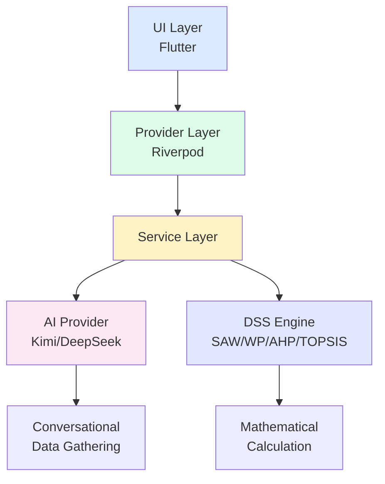

<div class="cover-content">
  <div class="cover-kicker">Class Presentation</div>
  <h1>Smart DSS AI Assistant</h1>
  <h2 class="cover-subtitle-title">AI-Assisted Decision Support System</h2>
  <div class="cover-divider"></div>
  <p class="cover-desc">
    Menggabungkan AI sebagai pengumpul data percakapan dengan perhitungan matematis DSS yang rigor untuk pengambilan keputusan yang objektif dan transparan
  </p>
  <div class="cover-meta">
    <div>Prima Adi</div>
    <div>Ade Dwi</div>
    <div>DSS Methods: SAW, WP, AHP, TOPSIS</div>
    <div>AI Providers: Kimi (Primary), DeepSeek (Fallback)</div>
  </div>
</div>

---
layout: ugm-section
---

<div class="section-content">
  <h1>Apa itu DSS?</h1>
  <p>
    Decision Support System: Sistem komputer yang membantu pengambilan keputusan untuk masalah kompleks dan tidak terstruktur
  </p>
</div>

---
layout: ugm-content
---

# Decision Support System (DSS)

## Definisi

<v-clicks>

- **Sistem komputer** yang mendukung aktivitas pengambilan keputusan
- Membantu manusia membuat keputusan untuk masalah **kompleks** dan **tidak terstruktur**
- Menggabungkan **data**, **model**, dan **antarmuka pengguna**

</v-clicks>

## Komponen Utama DSS

<v-clicks>

1. **Data Management** - Mengumpulkan dan mengorganisir data keputusan
2. **Model Management** - Model matematis untuk analisis
3. **User Interface** - Interaksi mudah dengan sistem
4. **Knowledge Management** - AI/keahlian untuk panduan

</v-clicks>

## Mengapa DSS?

<v-clicks>

- ✅ Mengurangi kompleksitas keputusan
- ✅ Memberikan analisis objektif
- ✅ Mempercepat proses pengambilan keputusan
- ✅ Mengurangi kesalahan perhitungan manusia

</v-clicks>

---
layout: ugm-section
---

<div class="section-content">
  <h1>Masalah yang Kami Selesaikan</h1>
  <p>
    Tantangan dalam DSS tradisional dan bagaimana AI dapat membantu
  </p>
</div>

---
layout: ugm-content
---

# Tantangan DSS Tradisional

<div class="one-col-copy">
  <div class="lead-box">
    DSS tradisional sering gagal diadopsi karena kompleksitas input data dan kurangnya pengetahuan teknis pengguna
  </div>

## Masalah Utama:

<v-clicks>

### 1. Input Data yang Kompleks
- Pengguna harus mengisi semua kriteria, alternatif, dan skor secara manual
- Format form yang mengintimidasi
- Proses membosankan dan memakan waktu

### 2. Dibutuhkan Pengetahuan Teknis
- Pengguna harus memahami metode DSS
- Tidak semua pengambil keputusan adalah ahli DSS
- Kurva belajar yang curam

### 3. Rentan Error
- Input manual menyebabkan kesalahan
- Tidak ada validasi real-time
- Kesalahan kecil = hasil salah besar

### 4. UX yang Buruk
- Antarmuka tradisional mengintimidasi
- Banyak pengguna menyerah di tengah jalan
- DSS hanya untuk ahli, bukan untuk semua orang

</v-clicks>
</div>

---
layout: ugm-content
background: "#f8fafc"
---

# Solusi Kami: AI + DSS Tradisional

<div class="two-col">
  <div class="col">
    <div class="card">
      <h3>🤖 AI sebagai UX Layer</h3>
      <ul>
        <li>Wawancara percakapan alami</li>
        <li>Mengajukan pertanyaan satu per satu</li>
        <li>Menyesuaikan bahasa (EN/ID)</li>
        <li>Memahami konteks dari chat</li>
      </ul>
    </div>
  </div>
  <div class="col">
    <div class="card">
      <h3>🧮 Kode sebagai Math Engine</h3>
      <ul>
        <li>Perhitungan matematis yang rigor</li>
        <li>Metode SAW, WP, AHP, TOPSIS</li>
        <li>Dapat diverifikasi dan diaudit</li>
        <li>Menampilkan langkah perhitungan</li>
      </ul>
    </div>
  </div>
</div>

## Konsep Kunci:

<div class="lead-box" style="margin-top: 2rem; background: #dbeafe; border-left-color: #3b82f6;">
  <strong>"AI tidak menghitung - AI menjelaskan. Kode kami yang menghitung dengan rigor matematis."</strong>
</div>

---
layout: ugm-section
---

<div class="section-content">
  <h1>Metode DSS yang Kami Dukung</h1>
  <p>
    Empat metode standar untuk berbagai jenis keputusan
  </p>
</div>

---
layout: ugm-content
---

# Metode DSS dalam Aplikasi Kami

<div class="grid grid-cols-2 gap-4">
  <div class="card" v-click>
    <h3>📊 SAW</h3>
    <p><strong>Simple Additive Weighting</strong></p>
    <p>Σ (skor × bobot)</p>
    <ul>
      <li>Normalisasi ke skala 0-1</li>
      <li>Kalikan dengan bobot</li>
      <li>Jumlahkan untuk skor akhir</li>
    </ul>
    <p class="text-sm text-gray-500 mt-2">Cocok untuk: Keputusan sederhana dengan kriteria independen</p>
  </div>
  
  <div class="card" v-click>
    <h3>✖️ WP</h3>
    <p><strong>Weighted Product</strong></p>
    <p>Π (skor^bobot)</p>
    <ul>
      <li>Kalikan semua skor</li>
      <li>Pangkatkan dengan bobot</li>
      <li>Perkalian bukan penjumlahan</li>
    </ul>
    <p class="text-sm text-gray-500 mt-2">Cocok untuk: Relasi yang saling menguatkan</p>
  </div>
  
  <div class="card" v-click>
    <h3>🎯 AHP</h3>
    <p><strong>Analytic Hierarchy Process</strong></p>
    <p>Matriks perbandingan berpasangan</p>
    <ul>
      <li>Bandingkan kriteria satu per satu</li>
      <li>Hitung eigenvector</li>
      <li>Cek Consistency Ratio</li>
    </ul>
    <p class="text-sm text-gray-500 mt-2">Cocok untuk: Keputusan kompleks dengan subjektivitas</p>
  </div>
  
  <div class="card" v-click>
    <h3>📏 TOPSIS</h3>
    <p><strong>Technique for Order Preference</strong></p>
    <p>Jarak dari solusi ideal</p>
    <ul>
      <li>Temukan solusi ideal positif & negatif</li>
      <li>Hitung jarak dari masing-masing</li>
      <li>Ranking berdasarkan kedekatan relatif</li>
    </ul>
    <p class="text-sm text-gray-500 mt-2">Cocok untuk: Mencari yang paling mendekati sempurna</p>
  </div>
</div>

---
layout: ugm-section
background: "#1e293b"
class: "text-white"
---

<div class="section-content">
  <h1>Deep Dive: AHP Method</h1>
  <p>
    Metode paling canggih untuk keputusan dengan penilaian subjektif
  </p>
</div>

---
layout: ugm-content
---

# Analytic Hierarchy Process (AHP)

## Mengapa AHP?

<v-clicks>

- ✅ Metode paling canggih dan terstruktur
- ✅ Menangani penilaian subjektif secara sistematis
- ✅ Memastikan konsistensi penilaian
- ✅ Validasi matematis melalui Consistency Ratio
- ✅ Digunakan secara luas dalam penelitian

</v-clicks>

## Matematika di Balik AHP

### Step 1: Matriks Perbandingan Berpasangan

<v-click>

Skala Saaty:

| Nilai | Keterangan |
|-------|-----------|
| 1 | Sama penting |
| 3 | Sedikit lebih penting |
| 5 | Lebih penting |
| 7 | Sangat lebih penting |
| 9 | Mutlak lebih penting |
| 2,4,6,8 | Nilai antara |

</v-click>

---
layout: ugm-content
---

# AHP: Contoh Matriks Perbandingan

## Contoh: Memilih Laptop

Kriteria: **Harga (C1)**, **Performa (C2)**, **Baterai (C3)**

**Penilaian Pengguna:**
- Harga sedikit lebih penting dari Performa (3)
- Harga lebih penting dari Baterai (5)
- Performa sedikit lebih penting dari Baterai (3)

**Matriks Perbandingan:**

|       | C1 (Harga) | C2 (Performa) | C3 (Baterai) |
|-------|-----------|--------------|-------------|
| C1    | 1         | 3            | 5           |
| C2    | 1/3       | 1            | 3           |
| C3    | 1/5       | 1/3          | 1           |

<v-click>

**Catatan:** Matriks resiprokal (jika A=3x B, maka B=1/3x A)

</v-click>

---
layout: ugm-content
background: "#f0fdf4"
---

# AHP: Langkah Perhitungan

## Step 2: Normalisasi Kolom

<v-clicks>

```
Jumlah Kolom:
C1: 1 + 0.333 + 0.2 = 1.533
C2: 3 + 1 + 0.333 = 4.333
C3: 5 + 3 + 1 = 9
```

**Normalisasi:** Bagi setiap sel dengan jumlah kolom

|       | C1    | C2    | C3    |
|-------|-------|-------|-------|
| C1    | 0.652 | 0.692 | 0.556 |
| C2    | 0.217 | 0.231 | 0.333 |
| C3    | 0.131 | 0.077 | 0.111 |

</v-clicks>

## Step 3: Hitung Priority Vector (Eigenvector)

<v-click>

```
Rata-rata setiap baris = Bobot Prioritas

C1: (0.652 + 0.692 + 0.556) / 3 = 0.633
C2: (0.217 + 0.231 + 0.333) / 3 = 0.260
C3: (0.131 + 0.077 + 0.111) / 3 = 0.106

→ Harga: 63.3%, Performa: 26.0%, Baterai: 10.6%
```

</v-click>

---
layout: ugm-content
background: "#fef3c7"
---

# AHP: Consistency Check ⭐

## Step 4: Periksa Konsistensi Penilaian

**Mengapa penting?** Pastikan penilaian pengguna konsisten (tidak kontradiktif)

<v-clicks>

**Hitung λmax (Eigenvalue maksimum):**
```
λmax = Σ (jumlah kolom × bobot prioritas)
λmax = (1.533 × 0.633) + (4.333 × 0.260) + (9 × 0.106)
λmax = 0.970 + 1.127 + 0.954 = 3.051
```

**Hitung Consistency Index (CI):**
```
CI = (λmax - n) / (n - 1)
CI = (3.051 - 3) / 2 = 0.026
```

**Hitung Consistency Ratio (CR):**
```
CR = CI / RI
RI untuk n=3 adalah 0.58 (Random Index tabel)
CR = 0.026 / 0.58 = 0.045
```

</v-clicks>

<v-click>

<div class="lead-box" style="background: #dcfce7; border-left-color: #22c55e;">
  <strong>CR = 0.045 < 0.10</strong> → <strong>KONSISTEN ✓</strong>
  <br>
  <small>Jika CR ≥ 0.10, penilaian perlu direvisi!</small>
</div>

</v-click>

---
layout: ugm-section
---

<div class="section-content">
  <h1>Alur Kerja Aplikasi</h1>
  <p>
    Bagaimana AI mengumpulkan data dan kode menghitung hasil
  </p>
</div>

---
layout: ugm-content
---

# Alur Kerja: AI sebagai Data Gatherer

## Step-by-Step User Journey

<v-clicks>

### 1. Buka Aplikasi
- Antarmuka chat yang ramah
- AI menyapa dalam bahasa pilihan (EN/ID)

### 2. Definisikan Keputusan
- AI: "Keputusan apa yang ingin Anda buat?"
- User: "Saya ingin membeli laptop"

### 3. Kumpulkan Kriteria (Satu per Satu)
- AI: "Kriteria apa yang penting?"
- User: "Harga"
- AI: "Apakah ini benefit (lebih baik lebih tinggi) atau cost (lebih baik lebih rendah)?"
- User: "Cost"
- AI: "Seberapa penting (bobot 0-1)?"
- User: "0.4"

### 4. Kumpulkan Alternatif
- AI: "Alternatif apa yang tersedia?"
- User: "MacBook Pro, Dell XPS, ThinkPad"

### 5. Kumpulkan Skor
- AI minta rating setiap alternatif untuk setiap kriteria

### 6. Hitung dan Jelaskan
- User pilih metode (AHP/SAW/WP/TOPSIS)
- Sistem hitung hasil
- AI jelaskan hasil dalam bahasa manusia

</v-clicks>

---
layout: ugm-content
background: "#eff6ff"
---

# Arsitektur Sistem

## Three-Layer Architecture



## Komponen Utama:

<v-clicks>

- **UI Layer**: Chat interface, visualisasi hasil, tabel perhitungan
- **Provider Layer**: State management dengan Riverpod
- **AI Provider**: Kimi (primary) atau DeepSeek (fallback)
- **DSS Engine**: Semua perhitungan matematis lokal

</v-clicks>

---
layout: ugm-content
---

# Contoh Kasus: Pemilihan Laptop

## Skenario Keputusan

**Alternatif:**
1. MacBook Pro M3 ($2000)
2. Dell XPS 15 ($1500)
3. ThinkPad X1 ($1800)

**Kriteria & Bobot (dari AHP):**

| Kriteria | Tipe | Bobot |
|----------|------|-------|
| Harga | Cost | 0.30 |
| Performa | Benefit | 0.25 |
| Baterai | Benefit | 0.20 |
| Kualitas | Benefit | 0.15 |
| Portabilitas | Benefit | 0.10 |

**Matriks Skor:**

| Alternatif | Harga | Performa | Baterai | Kualitas | Portabilitas |
|------------|-------|----------|---------|----------|-------------|
| MacBook Pro | 6/10 | 10/10 | 9/10 | 10/10 | 8/10 |
| Dell XPS | 8/10 | 8/10 | 7/10 | 8/10 | 7/10 |
| ThinkPad | 7/10 | 7/10 | 8/10 | 9/10 | 9/10 |

---
layout: ugm-content
background: "#f8fafc"
---

# Perhitungan SAW (Contoh)

## Formula: Σ (skor × bobot)

<v-clicks>

**Normalisasi (untuk cost: 1 - nilai):**
- Harga tertinggi = 8, terendah = 6
- MacBook: 6/8 = 0.75 → Cost: 1 - 0.75 = 0.25
- Dell: 8/8 = 1.00 → Cost: 1 - 1.00 = 0.00
- ThinkPad: 7/8 = 0.875 → Cost: 1 - 0.875 = 0.125

**Perhitungan Skor Akhir:**

**MacBook Pro:**
```
(0.25 × 0.30) + (1.00 × 0.25) + (0.90 × 0.20) + (1.00 × 0.15) + (0.80 × 0.10)
= 0.075 + 0.25 + 0.18 + 0.15 + 0.08
= 0.735 (73.5%)
```

**Dell XPS:**
```
(0.00 × 0.30) + (0.80 × 0.25) + (0.70 × 0.20) + (0.80 × 0.15) + (0.70 × 0.10)
= 0.00 + 0.20 + 0.14 + 0.12 + 0.07
= 0.530 (53.0%)
```

</v-clicks>

---
layout: ugm-content
---

# Hasil dan Interpretasi

## Ranking Akhir (SAW)

<v-click>

| Rank | Alternatif | Skor | Persentase |
|------|-----------|------|-----------|
| 🥇 1 | MacBook Pro | 0.735 | 73.5% |
| 🥈 2 | ThinkPad X1 | 0.685 | 68.5% |
| 🥉 3 | Dell XPS | 0.530 | 53.0% |

</v-click>

<v-click>

## Penjelasan AI:

> "**MacBook Pro** menang karena meskipun harganya lebih tinggi, unggul dalam **performa (bobot 25%)** dan **kualitas build (bobot 15%)** yang merupakan kriteria paling penting setelah harga.
>
> Dell XPS terendah karena harga bukan satu-satunya faktor - performa dan kualitas juga berpengaruh besar terhadap keputusan akhir."

</v-click>

<v-click>

## Kenapa AI Tidak Menghitung?

<div class="two-col">
  <div class="col">
    <h4>AI Menjelaskan:</h4>
    <ul>
      <li>Mengapa pemenang menang</li>
      <li>Trade-off antar kriteria</li>
      <li>Insight dalam bahasa manusia</li>
    </ul>
  </div>
  <div class="col">
    <h4>Kode Menghitung:</h4>
    <ul>
      <li>Matematika yang rigor</li>
      <li>Dapat diaudit dan diverifikasi</li>
      <li>Konsisten dan deterministik</li>
    </ul>
  </div>
</div>

</v-click>

---
layout: ugm-section
background: "#1e293b"
class: "text-white"
---

<div class="section-content">
  <h1>Kenapa Pemisahan AI dan Kode?</h1>
  <p>
    Desain kritis: AI untuk UX, Kode untuk matematika
  </p>
</div>

---
layout: ugm-content
---

# Pemisahan AI dan Kode: Mengapa Penting?

<div class="lead-box">
  <strong>"AI tidak menghitung - AI menjelaskan. Kode kami yang menghitung dengan rigor matematis."
</div>

## Peran AI: Conversational Guide

<v-clicks>

- ✅ **Ekstraksi data** dari bahasa alami
- ✅ **Mengajukan pertanyaan** klarifikasi
- ✅ **Menjelaskan hasil** dalam bahasa manusia
- ✅ **Memberikan insight** tentang trade-off

</v-clicks>

## Peran Kode: Mathematical Engine

<v-clicks>

- ✅ **Melakukan perhitungan** SAW/WP/AHP/TOPSIS
- ✅ **Menjamin kebenaran matematis**
- ✅ **Hasil dapat diverifikasi**
- ✅ **Menampilkan langkah perhitungan** (matriks normalisasi, dll)

</v-clicks>

## Mengapa Pemisahan Ini?

<v-clicks>

1. **Akurasi** - Kode deterministik, AI bisa "halusinasi" perhitungan
2. **Kepercayaan** - User dapat memverifikasi matematika
3. **Konsistensi** - Data sama = hasil sama selalu
4. **Transparansi** - Tunjukkan cara kerja, bukan hanya jawaban
5. **Edukasi** - User belajar cara kerja metode DSS

</v-clicks>

---
layout: ugm-section
---

<div class="section-content">
  <h1>Implementasi Teknis</h1>
  <p>
    Arsitektur kode dan penggunaan Strategy Pattern
  </p>
</div>

---
layout: ugm-content
---

# Tech Stack & Arsitektur

## Teknologi yang Digunakan

<div class="grid grid-cols-2 gap-4">
  <div class="card">
    <h4>🎨 Frontend</h4>
    <ul>
      <li><strong>Flutter</strong> - Cross-platform UI</li>
      <li><strong>Dart</strong> - Type-safe, fast</li>
      <li><strong>Riverpod</strong> - State management</li>
    </ul>
  </div>
  
  <div class="card">
    <h4>☁️ Backend</h4>
    <ul>
      <li><strong>Firebase</strong> - Auth & Firestore</li>
      <li><strong>Google Sign-In</strong> - Autentikasi</li>
      <li><strong>Cloud Sync</strong> - Sinkronisasi data</li>
    </ul>
  </div>
  
  <div class="card">
    <h4>🤖 AI Integration</h4>
    <ul>
      <li><strong>Kimi</strong> - Primary provider</li>
      <li><strong>DeepSeek</strong> - Fallback provider</li>
      <li><strong>Dio</strong> - HTTP client</li>
    </ul>
  </div>
  
  <div class="card">
    <h4>📊 DSS Engine</h4>
    <ul>
      <li><strong>Local Calculation</strong> - 100% on-device</li>
      <li><strong>4 Methods</strong> - SAW, WP, AHP, TOPSIS</li>
      <li><strong>Consistency Check</strong> - AHP validation</li>
    </ul>
  </div>
</div>

---
layout: ugm-content
background: "#f0f9ff"
---

# Strategy Pattern: AI Provider Abstraction

## Desain Terbaru: Multiple AI Providers

<div class="lead-box" style="background: #e0f2fe; border-left-color: #0ea5e9;">
  <strong>Kimi sebagai Primary, DeepSeek sebagai Fallback</strong>
  <br>
  Strategy Pattern untuk clean architecture dan extensibility
</div>

## Struktur Kode:

<v-click>

```dart
// Abstract Interface
abstract class AIProvider {
  String get providerName;
  Future<String> getChatResponse(...);
  Future<String> getCalculationAnalysis(...);
  Future<Map<String, dynamic>?> extractStructuredData(...);
}

// Implementations
class KimiProvider implements AIProvider { ... }
class DeepSeekProvider implements AIProvider { ... }

// Factory Pattern
class AIProviderFactory {
  static AIProvider? createProvider() {
    // Check KIMI_API_KEY first (Primary)
    // Then DEEPSEEK_API_KEY (Fallback)
  }
}
```

</v-click>

<v-click>

## Keuntungan:
- ✅ Mudah tambah provider baru (OpenAI, Claude, dll)
- ✅ Switch provider tanpa ubah business logic
- ✅ Testable dengan mock provider
- ✅ Follows Open/Closed Principle

</v-click>

---
layout: ugm-content
---

# DSS Engine: Kode Perhitungan

## File: `lib/logic/dss_engine.dart`

<v-click>

```dart
class DSSEngine {
  // SAW Method
  static List<RankingResult> calculateSAW(
    List<Criterion> criteria,
    List<Alternative> alternatives,
  ) { ... }
  
  // WP Method
  static List<RankingResult> calculateWP(
    List<Criterion> criteria,
    List<Alternative> alternatives,
  ) { ... }
  
  // AHP Method
  static List<RankingResult> calculateAHP(
    List<Criterion> criteria,
    List<Alternative> alternatives,
  ) { ... }
  
  // TOPSIS Method
  static List<RankingResult> calculateTOPSIS(
    List<Criterion> criteria,
    List<Alternative> alternatives,
  ) { ... }
}
```

</v-click>

<v-click>

## Semua perhitungan dilakukan **lokal di device**!
- Tidak perlu internet untuk kalkulasi
- Data tidak keluar dari device
- Instan (tidak ada latency)
- Dapat diverifikasi

</v-click>

---
layout: ugm-section
---

<div class="section-content">
  <h1>Aplikasi Real-World</h1>
  <p>
    Di mana aplikasi ini bisa digunakan?
  </p>
</div>

---
layout: ugm-content
---

# Aplikasi di Dunia Nyata

## Personal Decisions

<v-clicks>

- 🚗 **Membeli mobil/laptop/HP** - Bandingkan spesifikasi dan harga
- 🎓 **Memilih universitas** - Kriteria: biaya, ranking, lokasi, jurusan
- 💼 **Menerima tawaran kerja** - Gaji, benefit, lokasi, karir
- 💒 **Memilih venue pernikahan** - Harga, kapasitas, lokasi, fasilitas

</v-clicks>

## Business Decisions

<v-clicks>

- 🏢 **Seleksi supplier** - Harga, kualitas, delivery time, reputasi
- 💹 **Opsi investasi** - Return, risk, liquidity, time horizon
- 📊 **Prioritas proyek** - Budget, impact, resources, timeline
- 📍 **Seleksi lokasi** - Cost, accessibility, market, regulations

</v-clicks>

## Public Sector

<v-clicks>

- 🏛️ **Evaluasi kebijakan** - Impact, cost, feasibility, acceptance
- 💰 **Alokasi dana proyek** - Benefit, cost, urgency, alignment
- 🤝 **Vendor selection** - Technical, financial, experience
- ⚖️ **Alokasi sumber daya** - Demand, cost, availability, priority

</v-clicks>

## Bisa Digunakan Untuk:

**Setiap keputusan dengan:**
- ✅ Multiple criteria
- ✅ Multiple alternatives
- ✅ Trade-offs antar pilihan

---
layout: ugm-section
background: "#1e293b"
class: "text-white"
---

<div class="section-content">
  <h1>Demo</h1>
  <p>
    Live walkthrough aplikasi Smart DSS AI Assistant
  </p>
</div>

---
layout: ugm-content
---

# Demo: Alur Penggunaan

## Yang Akan Ditunjukkan:

<v-clicks>

1. **Buka aplikasi** - Tampilan chat interface
2. **Mulai keputusan baru** - Contoh: "Memilih Universitas"
3. **Chat dengan AI** - Definisikan kriteria satu per satu:
   - Biaya kuliah (cost, bobot 0.30)
   - Ranking kampus (benefit, bobot 0.25)
   - Lokasi (benefit, bobot 0.20)
   - Kualitas jurusan (benefit, bobot 0.15)
   - Fasilitas (benefit, bobot 0.10)
4. **Masukkan alternatif** - UI, ITB, UGM
5. **Input skor** - Rating untuk setiap kriteria
6. **Pilih metode** - AHP (dengan consistency check)
7. **Lihat hasil** - Ranking dan penjelasan
8. **Verifikasi** - Lihat matriks perhitungan

</v-clicks>

## Perhatikan:

<v-clicks>

- 💬 **Natural conversation** - Tidak ada form yang mengintimidasi
- 🎯 **One question at a time** - AI tidak membanjiri user
- 🌍 **Bahasa Indonesia** - Fully localized
- 📊 **Clear visualization** - Tabel dan grafik hasil
- 🧮 **Calculation matrices** - Bisa diverifikasi

</v-clicks>

---
layout: ugm-section
---

<div class="section-content">
  <h1>Tantangan & Solusi</h1>
  <p>
    Masalah yang kami hadapi dan cara mengatasinya
  </p>
</div>

---
layout: ugm-content
---

# Tantangan dan Solusi

## Challenge 1: Akurasi Ekstraksi Data AI

<div class="two-col">
  <div class="col">
    <h4>😰 Masalah:</h4>
    <p>AI mungkin melewatkan data atau ekstrak secara tidak akurat</p>
  </div>
  <div class="col">
    <h4>✅ Solusi:</h4>
    <ul>
      <li>Structured prompts</li>
      <li>Validasi data</li>
      <li>Konfirmasi user</li>
    </ul>
  </div>
</div>

## Challenge 2: Kompleksitas Multiple DSS Methods

<div class="two-col">
  <div class="col">
    <h4>😰 Masalah:</h4>
    <p>User bingung memilih metode yang tepat</p>
  </div>
  <div class="col">
    <h4>✅ Solusi:</h4>
    <ul>
      <li>AI rekomendasikan berdasarkan data</li>
      <li>Penjelasan user-friendly</li>
      <li>Bisa coba semua metode</li>
    </ul>
  </div>
</div>

## Challenge 3: Konsistensi dalam AHP

<div class="two-col">
  <div class="col">
    <h4>😰 Masalah:</h4>
    <p>Penilaian user mungkin inkonsisten</p>
  </div>
  <div class="col">
    <h4>✅ Solusi:</h4>
    <ul>
      <li>Hitung Consistency Ratio</li>
      <li>Warning jika CR ≥ 0.1</li>
      <li>Sarankan revisi</li>
    </ul>
  </div>
</div>

---
layout: ugm-content
---

# Tantangan Lanjutan

## Challenge 4: Penggunaan Offline

<div class="two-col">
  <div class="col">
    <h4>😰 Masalah:</h4>
    <p>Tidak ada internet = tidak bisa pakai AI</p>
  </div>
  <div class="col">
    <h4>✅ Solusi:</h4>
    <ul>
      <li>Mode input manual (planned)</li>
      <li>Perhitungan tetap lokal</li>
      <li>Sync saat online</li>
    </ul>
  </div>
</div>

## Challenge 5: Biaya API AI

<div class="two-col">
  <div class="col">
    <h4>😰 Masalah:</h4>
    <p>API call AI berbiaya per penggunaan</p>
  </div>
  <div class="col">
    <h4>✅ Solusi:</h4>
    <ul>
      <li>Efficient prompts</li>
      <li>Data caching</li>
      <li>Provider fallback (Kimi/DeepSeek)</li>
    </ul>
  </div>
</div>

---
layout: ugm-section
---

<div class="section-content">
  <h1>Kesimpulan</h1>
  <p>
    Apa yang kami pelajari dari proyek ini?
  </p>
</div>

---
layout: ugm-content
background: "#f0fdf4"
---

# Key Takeaways

## Pelajaran Utama dari Proyek Ini:

<v-clicks>

### 1. AI + Metode Tradisional = Kombinasi Kuat
- **AI** menangani kompleksitas UX
- **Metode tradisional** menjamin kebenaran
- Gabungan terbaik dari dua dunia

### 2. Metode DSS Memiliki Use Case Spesifik
- **SAW**: Keputusan sederhana, kriteria independen
- **WP**: Relasi yang saling menguatkan (multiplikatif)
- **AHP**: Penilaian subjektif dengan konsistensi
- **TOPSIS**: Mencari yang paling mendekati ideal

### 3. Rigor Matematis Penting
- Tampilkan langkah perhitungan
- Verifikasi konsistensi (AHP)
- Biarkan user audit matematika
- Jangan sembunyikan cara kerja

### 4. UX yang Baik Kritis untuk Adopsi DSS
- Antarmuka percakapan menurunkan hambatan
- Multi-language support
- Visualisasi yang jelas
- One question at a time

### 5. Arsitektur Bersih Memudahkan Evolusi
- Strategy pattern untuk AI providers
- Modular DSS engine
- Mudah extend dan maintain

</v-clicks>

---
layout: ugm-content
---

# Pengembangan Masa Depan

## Rencana Pengembangan

### Short Term 🎯

<v-clicks>

- [ ] Export hasil ke PDF/Excel
- [ ] Perbandingan metode (bandingkan 2 metode)
- [ ] Analisis sensitivitas (what-if scenarios)
- [ ] Voice input untuk aksesibilitas

</v-clicks>

### Medium Term 🚀

<v-clicks>

- [ ] Mode offline (input manual)
- [ ] Group decision making (kolaboratif)
- [ ] Custom DSS method builder
- [ ] Integrasi dengan sumber data eksternal

</v-clicks>

### Long Term 🌟

<v-clicks>

- [ ] Web version (Flutter Web)
- [ ] Desktop version (Windows/Mac/Linux)
- [ ] AI-powered method recommendation
- [ ] Library template keputusan

</v-clicks>

---
layout: ugm-section
background: "#1e293b"
class: "text-white"
---

<div class="section-content">
  <h1>Terima Kasih</h1>
  <p>
    Pertanyaan?
  </p>
</div>

---
layout: ugm-content
---

# Q&A

## Terima Kasih atas Perhatiannya!

<div class="two-col" style="margin-top: 2rem;">
  <div class="col">
    <h4>👥 Tim:</h4>
    <ul>
      <li><strong>Prima Adi</strong></li>
      <li><strong>Ade Dwi</strong></li>
    </ul>
  </div>
  <div class="col">
    <h4>📚 Repository:</h4>
    <ul>
      <li>GitHub: Smart DSS AI Assistant</li>
      <li>Tech: Flutter, Firebase, AI</li>
      <li>Metode: SAW, WP, AHP, TOPSIS</li>
    </ul>
  </div>
</div>

## Referensi:

<v-clicks>

**DSS Methods:**
- Saaty, T.L. (1980). The Analytic Hierarchy Process
- Hwang, C.L. & Yoon, K. (1981). Multiple Attribute Decision Making

**Tools:**
- Flutter: flutter.dev
- DeepSeek API: deepseek.com
- Kimi API: kimi.com

</v-clicks>

---
layout: end
---

<div class="text-center py-20">
  <h1 class="text-4xl font-bold mb-8">Smart DSS AI Assistant</h1>
  <p class="text-xl mb-8">AI-Assisted Decision Support System</p>
  <div class="text-lg text-gray-600">
    <p>"AI handles the conversation, code handles the calculation"</p>
  </div>
  <div class="mt-12">
    <p class="text-sm text-gray-500">Presented by: Prima Adi, Ade Dwi</p>
    <p class="text-sm text-gray-500">Sistem Pendukung Pembuat Keputusan</p>
  </div>
</div>

---

## Appendix: Cheat Sheet Metode DSS

| Metode | Formula | Cocok Untuk | Kompleksitas |
|--------|---------|-------------|--------------|
| **SAW** | Σ (skor × bobot) | Keputusan sederhana | ⭐ Rendah |
| **WP** | Π (skor^bobot) | Relasi multiplikatif | ⭐⭐ Sedang |
| **AHP** | Eigenvector + CR | Penilaian subjektif | ⭐⭐⭐ Tinggi |
| **TOPSIS** | Jarak dari ideal | Mencari terbaik | ⭐⭐ Sedang |

### Threshold AHP Consistency:
- **CR < 0.1** → Konsisten ✓
- **CR ≥ 0.1** → Inkonsisten ✗ (revisi penilaian)

### Pemisahan AI vs Code:
- **AI**: Percakapan, penjelasan, insight
- **Kode**: Perhitungan, validasi, verifikasi
